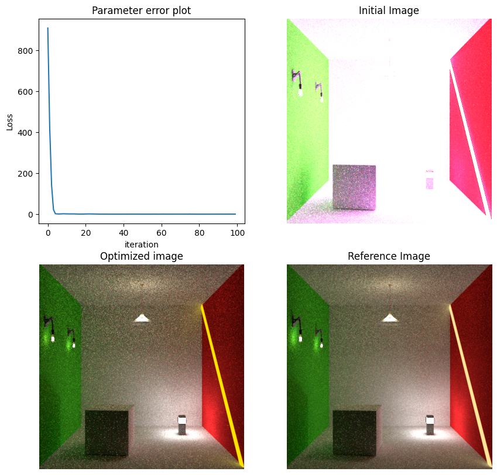
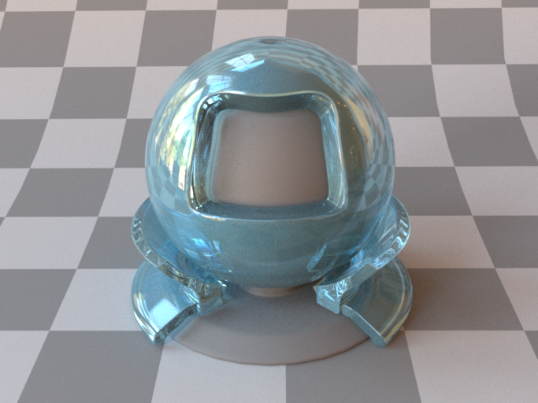
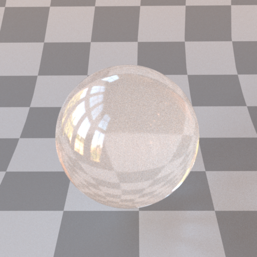
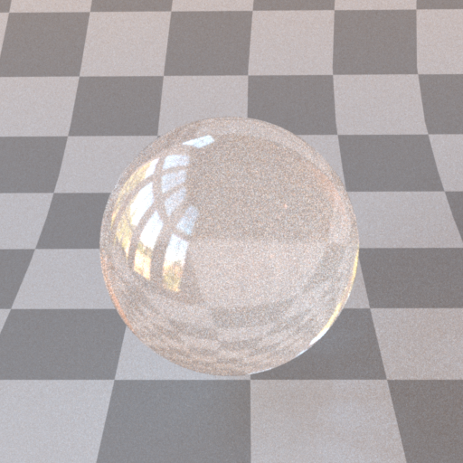
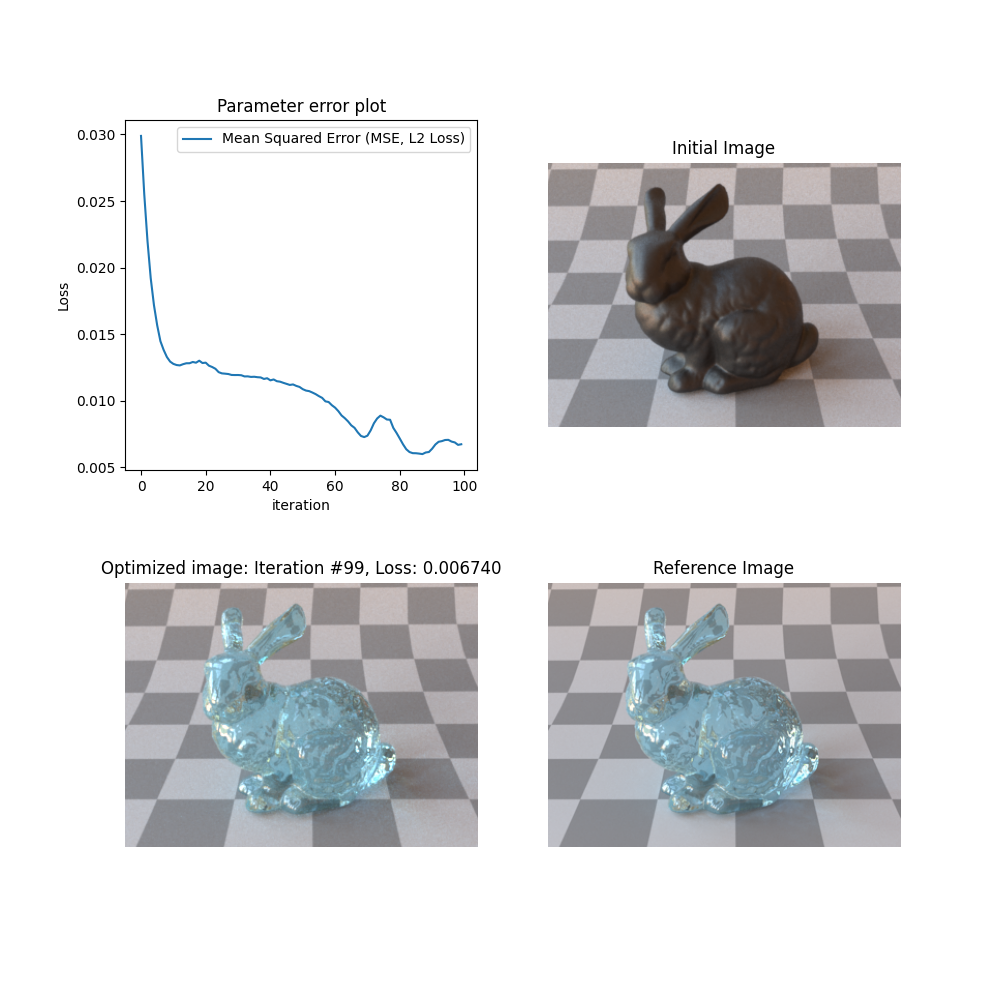

# LP Softwarepraktikum mit Bachelorarbeit (2022W)

- Name: Saip Can Hasbay
- Student Number: 01428723

## Notes

### 01.10.22

- Added guidelines
- Might be necessary:
  - Contact a professor, for a possible topic.

### 07.10.22

- [Slides](https://bit.ly/3Cm4xX1) available for the 07.10.22
- Bis abmeldefrist: topic necessary 14. Oct
- 4 Milestones:
  1. concrete Milestone identification
  2. 1.5th Month: prototype
  3. 3th Month: final impl. and tested
  4. 31.01: submission thesis + presentation
- Verification:
  - Presentation: 10%
    - Required: > 5%
  - Design & Code: 45%
    - Required: > 22.5%
  - Thesis: 45%
    - Required: > 22.5%
- Submission:
  - Thesis: LaTeX [Template available](https://zid.univie.ac.at/overleaf)
  - Moodle:
    - Thesis
    - Tool
  - GitLab
    - Ask to supervisor (**open**)
- Timeline:
  - 14 Oct: Topic and acknowlegment
- Currently everyone is on the waitlist
  - In case of arrangement w/ supervisor, contact Mr. Klas, Student will be officially part of the Thesis Process
- Topic
  - GFX
    - torsten.möller
  - SIP
  - Entertainment comp
    - helmut.hlavacs
  - Neuroinformatics
    - wentrup: 12.10, 16:45-20.00

### 13.10.22

- See email traffic w/ Prof. Hlavacs, for another thesis topic possiblity (**not relevant**)
- See email traffic w/ Prof. Moeller, David Hahn for thesis arrangements
  - Send email for a meeting w/ David and Torsten regarding clarifiying thesis timeline(**done**)
  - Send email to Prof. Klas for clarifying thesis topic (**done**)
- Thesis Topic: A modified/formulated version of [Shape optimization of light sources with global illumination objectives](https://www.cg.tuwien.ac.at/courses/projekte/Shape-optimization-light-sources-global-illumination-objectives)
- First notes from the talk w/ David:
  - TODO:
    - Analyse:
      - emissive texture
    - Read Related work:
      - [LightGuider: Guiding Interactive Lighting Design using Suggestions, Provenance, and Quality Visualization](https://doi.org/10.1109/TVCG.2019.2934658) (**done**)
      - [Procedural Design of Exterior Lighting for Buildings with Complex Constraints](https://doi.org/10.1145/2629573)
      - [Narrow-Band Topology Optimization on a Sparsely Populated Grid](https://doi.org/10.1145/3272127.3275012)
    - [Material parameter estimation](https://rgl.s3.eu-central-1.amazonaws.com/media/papers/Zeltner2021MonteCarlo.pdf) (**done**)
      - Try out in [Mitsuba](https://github.com/mitsuba-renderer/mitsuba3)
      - Use mitsuba and set up experimental situation, like box and material in the middle
        - give material parameters so we can achieve original image from real life
    - [Nerf](https://www.matthewtancik.com/nerf)
      - encode radiance field Nerfs w/ neurol networks
      - how much data does one neeeds for a neuiral structure
      - make a comparision w/ different renderers
    - half page or full page: abstract and when you want to finish

### 14.10.22

- Done following mitsuba tutorials:
  - [Mitsuba 3: Youtube tutorials](https://www.youtube.com/watch?v=9Ja9buZx0Cs)
  - [Mitsuba 3: Read the tocs tutorial, until Cuastics Opimization](https://mitsuba.readthedocs.io/en/stable/src/inverse_rendering/caustics_optimization.html)
- References:
  - Diederik P Kingma and Jimmy Ba. Adam: a method for stochastic optimization. arXiv preprint arXiv:1412.6980, 2014.
  - Stochastic Gradient Descent
    - Ilya Sutskever, James Martens, George Dahl, and Geoffrey Hinton. On the importance of initialization and momentum in deep learning. In International conference on machine learning, 1139?1147. 2013

### 15.10.22

- Prof Moeller, David (see also emails from 14.10):

  - Torsten

    > great. yes, let us meet. I am on conference next week, however. May I
    > suggest to find a time the week after? E.g. Mon, Oct 24th 12:30-3pm would
    > be possible for me. May I kindly ask you, Saip-Can, to create some slide
    > (ppt or keynote or beamer or whatever you like) to detail:
    >
    > - the problem/research question
    > - approach
    > - milestones

  - David

    > Sure, 24th afternoon works for me. I like the idea of having a summary slide.
    > Saip-Can, maybe you can summarize what we discussed yesterday (and also which direction seems most interesting to you), and let me know in case any further questions come up until then.

  - Can
    - Arrange meeting for 24.10.22, 14:00-15:00 (**done**)

- Read:
  - [Material parameter estimation](https://rgl.s3.eu-central-1.amazonaws.com/media/papers/Zeltner2021MonteCarlo.pdf) (**done**)
    - notes about the paper (**done**, see docs)
- drjit quick start tutorial (**done**)
- Work on _Material parameter estimation_ until at the end of 18.10.22

### 16.10.22

- Ideas:
  - As mentioned on the future work section of the paper _material parameter estimation_, one could add NEE that targets differentiates gradients specifically
    - Implementation of NEE
    - Comparision of NEE vs other methodologies
  - Inverse rendering, scene reconstruction from real world images:
    1. Real world image
    2. Inverse rendering (using mitsuba 3)
    3. Inverse modelling (mitsuba scene params to CAD app, e.g.)
    4. Compare results, user test (?)

### 17/18.10.22

- Worked on optimizing multiple scene parameters, see _optimization-test.ipynb_

### 20.10.22

- See notes on NeRFs
  - See highlights on the paper for additional repetition
- See notes on ReLU
  - See highlights on the paper for additional repetition
- Read regarding hybrid approaches that combine fast to evaluate data structures w/ cooordinate-based MLPs (optional, find references on ReLU paper)
  - Mueller et al 2022 [July 7th 2022] Paper won the SIGGRAPH Best Paper Award. (must read)
  - Martel et al 2021
- Read regarding: 3D shape can be encoded as an occupancy field (optional, find references on ReLU paper)

  - [Chen and Zhang 2019; Mescheder et al. 2019],
  - a signed distance field [Park et al. 2019]
  - or directly as a mesh in the form of a surface map Morreale et al 21

- Idea:
  1. Construct and render very simple models (i.e. very rough approximations of target/real world image)
  2. Optimize the constructed image through target/real-world images
     - The optimization step can be achieved through different approaches like:
       - _Material parameter estimation_

### 21.10.22

- See highlights on _Instant Neural Graphics Primitives with a Multiresolution Hash Encoding_

### 22.10.22

- Testing instang-ngp
  - References:
    - Building on windows:
      - [Youtube Building Tutorial](https://www.youtube.com/watch?v=kq9xlvz73Rg&feature=youtu.be)
      - [GitHub Building Tutorial](https://github.com/bycloudai/instant-ngp-Windows)
    - Hands on With Nvidia Instant NeRFs
      - [Youtube instant-ngp NeRFs tutorial](https://www.youtube.com/watch?v=z3-fjYzd0BA&t=71s)
    - Training times:
      - Franz, 54 Images, aabb:4, around 2 Mins
      - Bunny, 95 Images, aabb:4, more than 3 Mins
- To read:
  - @article{munkberg2021nvdiffrec,
    author = {Jacob Munkberg and Jon Hasselgren and Tianchang Shen and Jun Gao
    and Wenzheng Chen and Alex Evans and Thomas Mueller and Sanja Fidler},
    title = "{Extracting Triangular 3D Models, Materials, and Lighting From Images}",
    journal = {arXiv:2111.12503},
    year = {2021}
    }

### 24.10.22

- Talk w/ David, Torsten:

  - Students design light sources
  - it would be interesting to reconstruct light sources, estimate their materials
  - manipulate images e.g. w/ noise, try out whether you can still reconstruct a target image
  - read more on literature
  - try to playaround w/ the application that David mentioned

  ### 25.10.22

  - Maybe:
    - To reconstruct light sources:
      1. nerf target light source
      2. Mesh it
      3. Use material parameter optimization for the correct radiance value

### 26.10.22

- Try out:
  - Use different type of light sources and optimize their radiance (done)
    - Done w/ Mitsuba export
  - Use different type of light sources and optimize their shape + radiance (open)
    - Maybe first optimize their shape
    - then optimize their radiance (this can be done, as show on the prev. point)

### 27.10.22

- To reconstruct light sources or any other object:

  1. NeRF subject (e.g. light source: synthetic, or real life)
  2. Mesh it using marching cubes (see also _extracting triangular 3D Model, Materials, and Lighting From Images_)
  3. Use material parameter optimization to reconstruct reference image

     - As mentioned _extracting triangular 3D..._ the procedure is:
       - NeRF -> Marching Cubes -> Differentiable renderer

- Important note from _extracting triangular 3D..._:
  - _For performance reasons we use a differentiable rasterizer with deferred shading, hence reflections, refractions (e.g., glass), and translucency are not supported._
- Read, regarding marching cubes:
  - William E. Lorensen and Harvey E. Cline. Marching Cubes: A High Resolution 3D Surface Construction Algorithm. SIGGRAPH Comput. Graph., 21(4):163?169, 1987
  - Yiyi Liao, Simon Donn�e, and Andreas Geiger. Deep Marching Cubes: Learning Explicit Surface Representations. In Conference on Computer Vision and Pattern Recognition (CVPR), 2018.

### 29.10.22

- Questions for David:

  - What exactly is meant by optimizing light sources?
    - The object/shape itself
      - Material
      - Radiance/illumination
        - Like this: 
      - Object pose / positioning
      - All above
  - You mentioned that students design light sources, and it would be interesting to use/reconstruct what they have done on tamashii:
    - What would be the procedure?
    - Would the input be a (reference) image, or a mesh/object?
    - What would be the output after optimization?
      - A render on tamashii?
      - An image file?
      - A scene file
    - What would be the steps to achieve this task (from a client POV)? For example:
    1.  Student designs a light source/s
    2.  Student uploads the designed light source/s
    3.  Tamashii reconstructs/optimizes input
    4.  Tamashii shows the "result/s"...

- Additional work on optimization: see _optimization-test-4.ipynb_

### 31.10.22

- To Read:

  - _Physics based Differentiable Rendering: A comprehensive introduction - Zhao et. al_
  - _radiative backpropogation - merlin et. al_

- Update to the procedure mentioned on [27.10.22](#271022):

  - NeRF'ing emissive, dielectric (e.g. glass) materials or circular objects (e.g. sphere) does not seem to work
    - For emissive materials, one can do the following:
      - NeRF light source while it does not emmit. With appropriate materials (e.g. diffuse) the light source should be NeRF'able
    - For dielectric materials, spherical objects: **???**

- A simple GUI app for material-optimizer:
  - Load a scene file
  - Select scene parameters to modify/randomize
  - Optimize selected scene parameters

### 01.11.22

- Work on material-optimizer-gui

### 02.11.22

- course on _Physics based Differentiable Rendering: A comprehensive introduction - Zhao et. al_
  - [Course Website](https://shuangz.com/courses/pbdr-course-sg20/)
    - watched until: 1:48

### 03.11.22

- see email to david
- talk w/ david:
  - Peter has some box for experimenting materials from an object
    - Inside of the box is covered from external light sources
    - Box has multiple light sources to shade object of interest
    - One can put different (simple) objects inside the box and measure its material properties
    - It would be interesting to take multiple photographs (from different point of view) of the object (w/ different materials, e.g. I could bring a small simple roug-glass object\*, or if they have transparent materials such as frosted glass etc.)
    - The task then would be to reconstruct/optimize an initial materials properties on mitsuba, as previously done with synthetic data, however in this case the reference image would be an image taken from inside the box
    - Initially these task would be for simple objects, if successfull one can try the procedure for more complex object. In the future, one can also NeRF objects and try similar things

### 04.11.22

- further work on material-optimizer-gui:
  - modifiable param and optimization values

### 05.11.22

- User provided reference image: _high priority_
- modifiable scene params other than reflectance _high priority_
- iteration count _low priority_
- samples per pixel: _low priority_
- resolution: _low priority_
- randomize scene params: _low priority_

### 06/07/08.11.22

- User provided reference image: _high priority_ (done)
- resolution: _low priority_ (done: handled through resampling. Resampling according to loaded mitsuba scene file resolution definition)

### 09.11.22

- Meeting w/ Prof. Ferschin
  - discussion regarding what can be done
    - first of all I'll try to optimize simple dielectric materials
  - took sample images

### 10.11.22

- optimization support for 'radiance'
- optimization on custom image:
  - user should be able to define a min. error threshold (**open, not hight prio**)
  - user should be able to save optimized mitsuba 3 scene (**open, not hight prio**)
  - after the optimization finished, user should be able to select the state of the scene and render the scene in that state (e.g. optimization finished after 100th iteration and during it the minimum error threshold is not achieved, however user sees on the loss histogram plot the 51th iteration had lower loss value than the last state of the scene, thus user is able to select and use that scene state) (**open, not hight prio**)
  - support for dielectric materials (**open, high prio**)
- Feature requests are available on GitHub->Issues

### 11.11.22

- [Mitsuba 3 Discussion: Optimizing Dielectric Materials](https://github.com/mitsuba-renderer/mitsuba3/discussions/379)
- See also [GitHub Repository Issues](https://github.com/sapo17/BachelorThesis/issues) for development details on material-optimizer

### 12.11.22

- More work on material-optimizer

### 13/14.11.22

- Time spent on literature and nerfstudio:
  - Promising findings from [Deng et al](https://dl.acm.org/doi/abs/10.1145/3528233.3530714)
    - See notes on github [issue](https://github.com/sapo17/BachelorThesis/issues/23)
  - See also (all included on github issues):
    - [Inverse rendering approach for heterogeneous translucent materials](https://dl.acm.org/doi/10.1145/3013971.3013973)
    - [MobileNerF](https://mobile-nerf.github.io/)

### 16/17/18.11.22

- More work on material-optimizer (see github issues for more info)

### 19.11.22

- Promising results for optimizing translucent materials using _material-optimizer_. Results:
  - 
  - 
  - 
  - 

### 24.11.22

- Findings:
  - Naively taking images of objects to optimize their material does not work. The issue is mainly not being able create an initial 3D (mitsuba) scene for the optimization. The optimization through custom images calculates the loss function through the given custom image and the rendered image during optimization (e.g. mean squared error). If the entities (i.e. object of interest, light and camera position etc.) in the inital model does not match with the provided custom image, the calculated loss function will give wrong results. Following steps are necessary to be able to create an initial scene that would match the provided custom image.
    1. A controlled enviroment for taking sample images (e.g. following video is good example [turntable photogrammetry](https://www.youtube.com/watch?v=LzN1w6BlbZE))
    2. Taking a background image is necesarry for background removal (so that only the mesh of interest gets reconstructed during photogrammetry)
    3. If the object of interest is a translucent object, a non translucent object with identical geometry as the object of interest is necessary so that the photogrammetry step (geometry reconstruction) works.
    4. After taking enough sample images a photogrammetry tool to reconstruct the geometry of the object of interest is necessary (e.g. agisoft metashape)
    - Steps for agisoft metashape:
    1. Align photos
    2. Apply masks for background removal
    3. Construct model/mesh
    4. Export model (camera's must be included) as a _.3dm_ file
    5. Import _.3dm_ file in Blender
    6. Export blender scene as a mitsuba scene
    7. With the acquisition of a mitsuba scene _material-optimizer_ could be used to reconstruct materials of the object of interest

### 6.12.22

After including the functionality for supporting texture optimization, the optimization procedure is being able to successfully reconstruct varying color values of the object, although in a biased manner and this will be also discussed in the following paragraph.

Currently, mitsuba 3 supports following textures and from the supported textures it allows limited parameters to differentiate (i.e. to reconstruct in an inverse rendering scheme):

- Bitmap (bitmap)
  - parameter: data
    - type: tensor
    - description: Tensor array containing the texture data
- Checkerboard (checkerboard)
  - Unrelated differentiable parameters ommitted for the sake of conciseness. Please refer to mitsuba 3 documentation.
- Mesh attribute (mesh_attribute)
  - parameter: 'vertex*' or 'face*'
    - type: string
    - description: Name of the attribute to evaluate. It should always start with "vertex*" or "face*".
- Volumetric (volume)
  - parameter: volume
    - type: float, spectrum or volume
    - description: Volumetric texture (Default: 0.75)

'material-optimizer' which is based on mitsuba 3 renderer, supports above mentioned texture scene-parameters and as many others.
In the bottom right corner of the [Figure X](#figure-x), we can see the reference image that is being used for the material reconstruction. In the top right corner of [Figure X](#figure-x) the initial state and on the bottom left the optimized state is shown. In this example the optimization procedure took 100 iterations, used mean squared error (L2 Loss) as the optimization function, and used the Adam optimizer with the learning rate 0.03 for all the scene parameters that are being optimized, as shown in the top left corner of the [Figure X](#figure-x). More specifically, the following scene parameters have been optimized during the reconstruction procedure:

- The bottom plate, which is completly black and can bee seen in the initial image. The bottom plate has a diffuse BSDF and its albedo value is assigned to a bitmap texture. The initial value of the bitmap texture is a 64x64 black image.
- The circular material object, which is gray in the initial image. It has a Principled BSDF and its base color value is assigned to a bitmap texture. The initial value of the bitmap texture is a 512x512 black image.

As mentioned previously, the optimized image in [Figure X](#figure-x) is not actually accurate. Although at the first glance the properties of the green material seems to look reconstructed accurately as in the reference image, the translucent property (specifically 'spec_trans' parameter of the Principled BSDF) is unchanged after the optimization. The optimization procedure for the circular object is actually resulted in a bitmap texture that shows the background in various part of the circular-object [[Figure X2]](#figure-x2), however the object is still completly opaque. Thus, if the circular object is moved to another location, the background that it shows would be completly inaccurate. [Figure X](#figure-x)

#### Figure X

#### Figure X2: Bitmap texture after the optimization procedure

### 7.12.22

#### Material reconstruction from synthetic data:

In this section, we examine material reconstruction from synthethic data. More specifically, the reference image is rendered after a mitsuba scene 3 that is constructed digitally. The reference mitsuba scene is manipulated such that the render of the scene results in the initial image as in [Figure X3](#figure-x3). Compared to real world data, testing material reconstruction with synthethic data is much more straightforward, since the mitsuba scene is already given and does not require further modelling. In the case of real world data, scene reconstruction from the real world is much more difficult and requires a controlled environment where all the scene parameters that might effect the resulting image - such as light position, geometry of object - is known or at least approximated accurately.

In [Figure X3](#figure-x3) material reconstruction of a bunny is shown. As in the previous cases, the top left corner of the figure shows the parameter error plot, where x axis displays the iteration count and y axis shows the loss during optimization. The top right corner shows the initial state, top left the optimized image and lastly the top right corner shows the reference image. As mentioned previously, in the case of synthethic data, the reference scene is manipulated to arbitrary values that results in the initial image shown in [Figure X3](#figure-x3).

The bunny object that is shown in [Figure X3](#figure-x3) and [Figure X4](#figure-x4) is assigned to a Principled BSDF. The only difference between [Figure X3](#figure-x3) and [Figure X4](#figure-x4) is the used loss function. As can be seen in [Figure X4](#figure-x4), the material properties of the bunny converges more quickly to the reference image shown with the use of the Dual-Buffer Method by Deng et al. 2022. The details of the material optimization procedure - such as the scene parameters that are being used - can be found in the [Table X](#table-x).

#### Table X

| Parameters                            | Reference           | Figure X3                                                   | Figure X4                                                  |
| ------------------------------------- | ------------------- | ----------------------------------------------------------- | ---------------------------------------------------------- |
| Optimized Principled BSDF: roughness  | 0.01                | 0.0010000000474974513                                       | 0.0010000000474974513                                      |
| Initial Principled BSDF: roughness    | 0.01                | 0.5                                                         | 0.5                                                        |
| Optimized Principled BSDF: base_color | 0.412, 0.824, 0.999 | 0.40266287326812744, 0.8450221419334412, 0.9990000128746033 | 0.4148377776145935, 0.8116224408149719, 0.9704205989837646 |
| Initial Principled BSDF: base_color   | 0.412, 0.824, 0.999 | 0.1, 0.1, 0.1                                               | 0.1, 0.1, 0.1                                              |
| Optimized Principled BSDF: spec_trans | 0.9                 | 0.9112842082977295                                          | 0.9149118065834045                                         |
| Initial Principled BSDF: spec_trans   | 0.9                 | 0.02                                                        | 0.02                                                       |
| Loss Function                         | X                   | Mean Squared Error                                          | Dual Buffer Method Deng et al. 2022                        |
| Samples Per Pixel During Iteration    | X                   | 16                                                          | 8                                                          |
| Iteration Count                       | X                   | 100                                                         | 90                                                         |
| Minimum Error                         | X                   | 0.001                                                       | 0.001                                                      |
| Optimized Principled BSDF: eta        | 1.49                | Unable to converge if included                              | Unable to converge if included                             |
| Initial Principled BSDF: eta          | 1.49                | 1.54                                                        | 1.54                                                       |

In [Table X](#table-x) samples per pixel during iteration and iteration count is also shown. The Dual Buffer Method by Deng et al. 2022 reaches the defined minimum error by material-optimizer in the 90th iteration and consequently stops the optimization. The difference in samples per pixel during iteration is mainly how the Dual Buffer Method by Deng et al. 2022 is introduced. For further details please refer to the corresponding paper.

Interestingly, for the bunny object introducing the index of refraction (eta) parameter into the optimization procedure results in inaccurate results. This inability to optimize the index of refraction parameter of the bunny object does not only occur including into the optimization parameters such as roughness, but also trying to reconstruct it after the optimization is finished for the parameters such as roughness, base color and specular transmission. However, for a simple shape like in Figure X5, the index of refraction parameter converges into the correct result. In this example, the index of refraction value is optimized after reconstructing roughness, base color and specular transmission value.

The author would like to speculate that this inability of reconstructing the index of refraction value might be related to the geometry of the optimized shape (i.e. in this case the high-poly bunny object). Nonetheless, the causation requires a further scientific analysis, which is not the scope of this paper.

TODO show material-preview object example

#### Figure X3

#### Figure X4

Similar to the previous example in [Figure X3](#figure-x3), material reconstruction of a bunny object is shown in [Figure X6](#figure-x6) and [Figure X7](#figure-x7). However, in this figure the bunny object is assigned to a Roughdielectric BSDF with a volume (participating media: medium) inside. Consequently, this example uses a differentiable volumetric path tracer (_prbvolpath_) and reconstructs volumetric material properties. Thus, material-optimizer provides two way to reconstruct translucent objects: one via reconstructing Principled BSDF properties and the other with (Rough/Thin)Dielectric BSDF including a participating media interior. The [Table X2](#table-x2) shows the results of Figure 6 and Figure 7.

#### Table X2

| Parameters                            | Reference                               | Figure 6                                | Figure 7                                |
| ------------------------------------- | --------------------------------------- | --------------------------------------- | --------------------------------------- |
| Optimized Roughdielectric BSDF: alpha | 0.01                                    | 0.0010000000474974513                   | 0.042617008090019226                    |
| Initial Roughdielectric BSDF: alpha   | 0.01                                    | 0.98                                    | 0.98                                    |
| Optimized Homogeneous Medium: sigma_t | 0.4                                     | 0.5923337340354919                      | 0.38419654965400696                     |
| Initial Homogeneous Medium: sigma_t   | 0.4                                     | 0.7                                     | 0.7                                     |
| Optimized Homogeneous Medium: albedo  | Colored Volume (resolution: 16x16x16x3) | Colored Volume (resolution: 16x16x16x3) | Colored Volume (resolution: 16x16x16x3) |
| Initial Homogeneous Medium: albedo    | Colored Volume (resolution: 16x16x16x3) | Empty Volume (resolution: 16x16x16x3)   | Empty Volume (resolution: 16x16x16x3)   |
| Loss Function                         | X                                       | Mean Squared Error                      | Dual Buffer Method Deng et al. 2022     |
| Samples Per Pixel During Iteration    | X                                       | 16                                      | 8                                       |
| Iteration Count                       | X                                       | 100                                     | 32                                      |
| Minimum Error                         | X                                       | 0.001                                   | 0.001                                   |

Similar to the previous examples, the [Table X2](#table-x2) shows that the Dual Buffer Method introduced by Deng et al. 2022 produces quicker acceptable results. However, it is important to note that the optimized 'alpha' parameter for Figure 7 is still quite far away from the reference value. This is mainly caused from the chosen minimum error, thus the short iteration count and the fast convergence rate of the Dual Buffer Method. Assuming lower minimum error rate (i.e. longer iteration count), we would observe a closer alpha value to the reference. Another important thing to note is the optimized volume albedo. Similar to optimization of bitmap texture, the optimized volume may produced biased results, since in both cases the optized parameter (bitmap texture or volume) is a multidimensional array and during optimization tries to imitate the value/s in the provided reference image. The user must make sure that the provided scene and the reference image does not containe any indirect effects (such as background objects that can be seen through the transparent objects - these effects will be imitated inside the transparent object (i.e. bitmap texture or volume) during optimization) that would effect the optimization.
Parameters to optmize:

- orig:

        <float name="alpha" value="0.01"/>
        <float name="sigma_t" value="0.4"/>
        <rgb name="albedo" value="0.412, 0.824, 0.999"/>

  - volume data - see scenes\material-preview\textures\colored_albedo.vol

- optimized
  "object_bsdf.alpha.value": [
  0.0010000000474974513
  ],
  "medium1.sigma_t.value.value": [
  0.5923337340354919
  ](python\material-optimizer\images\material-optimizer-result-figure-bunny-principled-dual-buffer.png)
  - volume data: scenes\material-preview\textures\colored_albedo_optimized_mse.vol
  - 

Optimization stopped at #32, since it reached min. error threshold 0.001
Parameters to optmize:

- orig:

        <float name="alpha" value="0.01"/>
        <float name="sigma_t" value="0.4"/>
        <rgb name="albedo" value="0.412, 0.824, 0.999"/>

  - volume data - see scenes\material-preview\textures\colored_albedo.vol

- optimized
  "object_bsdf.alpha.value": [
  0.042617008090019226
  ],
  "medium1.sigma_t.value.value": [
  0.38419654965400696
  ](python\material-optimizer\images\material-optimizer-result-figure-bunny-principled-dual-buffer.png)

  - volume data: scenes\material-preview\textures\colored_albedo_optimized_mse.vol
  - - 

- TODO SHOW HOMOGENEOUS EXAMPLE, SHOW PRINCIPLED TEXTURED TRANSLUCENT EXAMPLE
